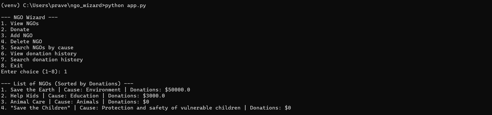
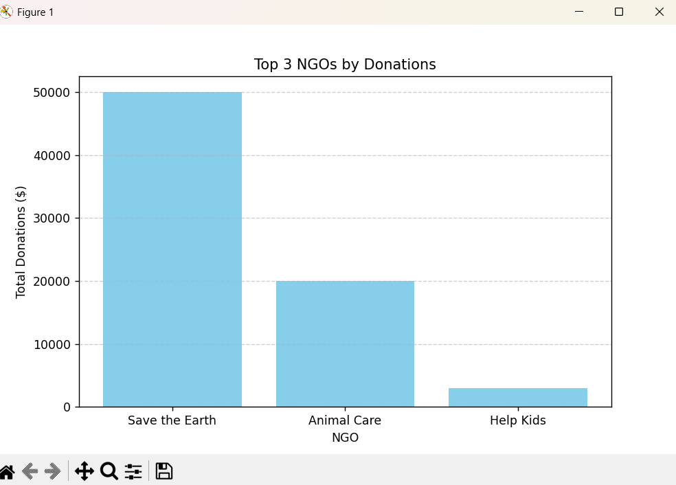

# NGO Wizard

**NGO Wizard** is a step-by-step platform to manage NGOs, track donations, and visualize top-performing NGOs, guiding users like a smart wizard — built for **ShikshaLokam Hackathon Theme 3**.

This project provides a simple, gamified approach to NGO program management, allowing donors and administrators to easily track, donate, and analyze NGO performance.

---

## Features

- View a **list of NGOs** sorted by total donations  
- Donate to NGOs securely and track your donation history  
- Add or delete NGOs (admin operations)  
- Search NGOs by cause (Environment, Education, Animals, etc.)  
- View and search **donation history**  
- Visualize the **Top 3 NGOs by donations** using a bar chart  

---

## Screenshots

**NGO List Output**  

  

**Top 3 NGOs Chart**  

  

> *Tip: Run the program to generate real-time charts and donation updates.*

---

## Technologies Used

- Python 3.x  
- JSON files for data storage (`ngos.json`, `donations.json`)  
- Matplotlib for visualizing donation trends  

---

## Installation / Run Locally

1. Clone the repository:

```bash
git clone https://github.com/praveenadurga135-commits/ngo_wizard
```

2. Navigate to the project folder:

```bash
cd ngo_wizard
```

3. (Optional) Create and activate a virtual environment:

```bash
python -m venv venv
# Windows
venv\Scripts\activate
# Mac/Linux
source venv/bin/activate
```

4. Install required packages:

```bash
pip install -r requirements.txt
```

5. Run the application:

```bash
python app.py
```

---

## Usage

- **View NGOs:** Shows all NGOs sorted by total donations  
- **Donate:** Select an NGO and enter donor name & amount  
- **Add / Delete NGO:** Admin operations  
- **Search NGOs by cause:** Filter NGOs by specific causes  
- **View / Search Donation History:** Track all donations made  

---

## Sample Output

**List of NGOs (Sorted by Donations):**

```
1. Save the Earth | Cause: Environment | Donations: $50000.0
2. Help Kids | Cause: Education | Donations: $3000.0
3. Animal Care | Cause: Animals | Donations: $0
4. Save the Children | Cause: Protection and safety of vulnerable children | Donations: $0
```

**Top 3 NGOs Chart:**  
(Bar chart generated automatically via Matplotlib)

---

## Outcome / Impact

- Provides a **transparent donation system**  
- Motivates donors by showing top-performing NGOs  
- Fully local and **easy to extend** into web or mobile apps  
- Can be adapted for **gamified program design**, guiding NGOs step-by-step  

---

## Author

**Team / Developer:** Praveen Adurga  
**Hackathon:** ShikshaLokam Hackathon 2026  
**Repository:** [GitHub - ngo_wizard](https://github.com/praveenadurga135-commits/ngo_wizard)  

---

